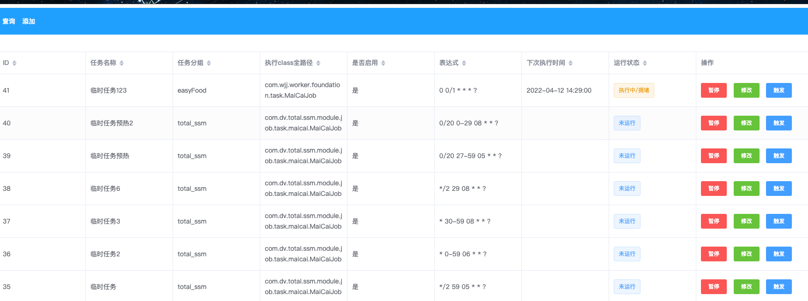

> ## 背景

​		疫情期间上海一菜难求，手机屏幕点破了仍然拥挤中...

​		无奈之下只能写入此程序解决部分问题，初衷仅时帮助广大群众及自身能填饱肚子
<br/>
**<font color="red">如非紧急情况不要轻易使用给普通人留点机会</font>**
<br/>
**此程序已帮助身边人都吃到菜了，感谢叮咚买菜**
<br/>

本程序有以下亮点

* **定时抢菜** (可自定义 cron 规则触发指定任务）

* **提前预热**

  （默认状态下在抢菜前半小时会每隔 20 秒轮询购物车内 **可用商品/可用配送时间/地址** 进行缓存，以防止高峰期出现获取商品拥堵状况，尽可能保证抢菜直接下单已尽可能最快速度进行抢菜）

* **多线程多时间抢菜**

  （默认状况下，一旦商品加入购物车内，只要有 **可用配送时间将会相同产品 选择不同配送时间同时提交** ，此功能作用显而易见为了方式由于高峰期抢菜导致以往可用实现失效状况 极大程度上提升了抢菜的成功效率）

* **可扩展性/维护性 高** （开发者可根据自己需求进行扩展）

* **提供日志记录/分布式任务**
  （开发者需根据自行需求选择性开启或关闭日志服务）
  此功能由WjjSyncJob注解实现 com.wjj.worker.foundation.annotation

* **容错相对较高**（根据返回结果对应删除缓存及相对调整策略）

* **自定义选择地址关键词**

> ##操作说明

1. 添加需要商品加入购物车，**不需要的商品一定要删除**
2. 全选购物车内容，去睡觉（不需要提交结算）
3. 静等结果🥰，抢到后及时付款，叮咚买菜5分钟就过期了订单

> ## 快速开始

### 创建主表
```
create table schedule_job_list
(
    SJL_ID            int auto_increment
        primary key,
    SJL_TASK_NAME     varchar(100)         null comment '任务名称',
    SJL_TASK_GROUP    varchar(20)          null comment '任务分组',
    SJL_CLASS_PATH    varchar(255)         null comment '执行class全路径',
    SJL_TRIGGER_NAME  varchar(50)          null comment '触发器名称',
    SJL_TRIGGER_GROUP varchar(50)          null comment '触发器分组',
    SJL_ENABLE        tinyint(1) default 1 not null comment '是否启用：0-否 1-是',
    SJL_EXPRESS       varchar(255)         null comment '表达式',
    SJL_REMARK        varchar(255)         null comment '备注',
    SJL_CREATE_TIME   datetime             null
)
##初始化任务

INSERT INTO schedule_job_list ( SJL_TASK_NAME, SJL_TASK_GROUP, SJL_CLASS_PATH, SJL_TRIGGER_NAME, SJL_TRIGGER_GROUP, SJL_ENABLE, SJL_EXPRESS, SJL_REMARK, SJL_CREATE_TIME) VALUES ( '5点59分至6点 每隔两秒执行一次 （预热）', 'easyFood', 'com.wjj.worker.foundation.task.MaiCaiJob', 'c9ec9ac4999c46f8b9741f72708b7c6b', 'easyFood', 1, '*/2 59 05 * * ?', null, '2022-04-07 16:50:26');
INSERT INTO schedule_job_list ( SJL_TASK_NAME, SJL_TASK_GROUP, SJL_CLASS_PATH, SJL_TRIGGER_NAME, SJL_TRIGGER_GROUP, SJL_ENABLE, SJL_EXPRESS, SJL_REMARK, SJL_CREATE_TIME) VALUES ( '6点至7点 每隔一秒执行一次', 'easyFood', 'com.wjj.worker.foundation.task.MaiCaiJob', 'a0fdf3f744af41c2b29eba7a3543aac2', 'easyFood', 1, '* 0-59 06 * * ?', null, '2022-04-08 03:25:45');
INSERT INTO schedule_job_list ( SJL_TASK_NAME, SJL_TASK_GROUP, SJL_CLASS_PATH, SJL_TRIGGER_NAME, SJL_TRIGGER_GROUP, SJL_ENABLE, SJL_EXPRESS, SJL_REMARK, SJL_CREATE_TIME) VALUES ( '8点半至9点 每隔一秒执行一次', 'easyFood', 'com.wjj.worker.foundation.task.MaiCaiJob', '5a5d254f3a754f6b94ac982c89d5e0af', 'easyFood', 1, '* 30-59 08 * * ?', null, '2022-04-08 03:28:44');
INSERT INTO schedule_job_list ( SJL_TASK_NAME, SJL_TASK_GROUP, SJL_CLASS_PATH, SJL_TRIGGER_NAME, SJL_TRIGGER_GROUP, SJL_ENABLE, SJL_EXPRESS, SJL_REMARK, SJL_CREATE_TIME) VALUES ( '8点29至8点半 每隔两秒执行一次 （预热）', 'easyFood', 'com.wjj.worker.foundation.task.MaiCaiJob', '718366cae3e943e4b2050e96d4dbcab3', 'easyFood', 1, '*/2 29 08 * * ?', null, '2022-04-08 03:29:11');
INSERT INTO schedule_job_list ( SJL_TASK_NAME, SJL_TASK_GROUP, SJL_CLASS_PATH, SJL_TRIGGER_NAME, SJL_TRIGGER_GROUP, SJL_ENABLE, SJL_EXPRESS, SJL_REMARK, SJL_CREATE_TIME) VALUES ( '5点27至5点59 每隔二十秒执行一次  （预热）', 'easyFood', 'com.wjj.worker.foundation.task.MaiCaiJob', 'c3f76588b99e493fbf0270b0597f0b66', 'easyFood', 1, '0/20 27-59 05 * * ?', null, '2022-04-08 15:32:28');
INSERT INTO schedule_job_list ( SJL_TASK_NAME, SJL_TASK_GROUP, SJL_CLASS_PATH, SJL_TRIGGER_NAME, SJL_TRIGGER_GROUP, SJL_ENABLE, SJL_EXPRESS, SJL_REMARK, SJL_CREATE_TIME) VALUES ( '8点至8点29 每隔二十秒执行一次 （预热） ', 'easyFood', 'com.wjj.worker.foundation.task.MaiCaiJob', '540feb861da74581b735b719ef388306', 'easyFood', 1, '0/20 0-29 08 * * ?', null, '2022-04-08 15:34:24');

```
### 日志服务及分布式任务（选择性创建）
**默认状态下未开启日志及分布式任务，如需请在 task job主入口 中增加注解 @WjjSyncJob**
```
create table schedule_job_log
(
    SJL_ID             int auto_increment
        primary key,
    SJL_TRIGGER_NAME   varchar(50) null comment '触发器名称',
    SJL_TRIGGER_GROUP  varchar(50) null comment '触发器分组',
    SJL_JOB_NAME       varchar(50) null comment 'job名称',
    SJL_JOB_GROUP      varchar(50) null comment 'job分组
',
    SJL_EXECUTE_STATUS tinyint(1)  null comment '执行结果：0-失败 1-成功',
    SJL_EXECUTE_RESULT text        null comment '执行结果日志',
    SJL_EXECUTE_TIME   datetime    null comment '执行时间'
)
```

​		安装 jdk1.8 && maven 自行百度配置相对简单

1. ```
    mvn clean & mvn install
    //stage target中获取 w-easy-food-stage.jar 启动
    nohup java -jar w-easy-food-stage.jar
    ```

2. 自行通过idea启动

 ```
    访问
    
    http://127.0.0.1:8080/
 ```


启动后默认 账户 easyfood 密码 11270809 可自行从 application.yml 进行更改 （spring.security.user 节点）
****

### 依赖中间件
		1. redis（用于缓存，默认开启建议使用，能减少访问频率增加抢菜成功率 没有的话可以从阿某云弄个按时的）
		2. mysql（用于数据存储，没有的话可以去 某信云托管 白嫖一个临时使用 ）
		3. maven（用于包管理，未安装请自行度娘安装）
### 配置说明

在 application-prod.yml 中 **wjj.worker.easyfood** 节点对应者程序运行的关键配置熟悉

| 属性           | 说明                                                                                      |
| -------------- |-----------------------------------------------------------------------------------------|
| notifyUrl      | 抢购结果通知，苹果推荐使用(Bark) / 安卓可使用server酱或其他方式可自行选择 <br />  默认发送时按照 https://xxx.xxx/标题/内容  方式发送 |
| addressKeyWord | 你的地址关键词关键词对应叮咚买菜中的 "门牌号" 模糊搜索                                                           |
| userId         | 用户ID通关抓包获取（抓包行为不再过多叙述，不懂的可自行百度获取对应软件然后打开叮咚买菜小程序查询看对应数据）对应 请求中 header “ddmc-uid” 字段      |
| userToken      | 用户token通过抓包获取 对应请求cookie DDXQSESSID 字段，此字段有效期较短实测大概在2天这样，请自行check及时更换                   |

> ## 版权说明

**本项目为 GPL3.0 协议，请所有进行二次开发的开发者遵守 GPL3.0协议，并且不得将代码用于一切商用。**

**创作不易，如帮助到你了，请点个 star 或 赞助开发者  手动狗头**

> ## 免责声明
**本项目仅供学习交流参考，一切由于其他开发者本身违法行为及商业侵权行为与本人无关**

**如侵权/及其他行为 请加v BeerGod1127 联系 备注来意**
